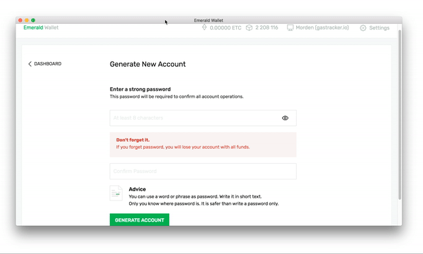
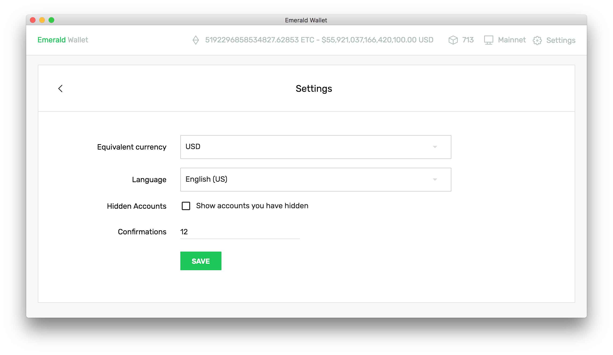
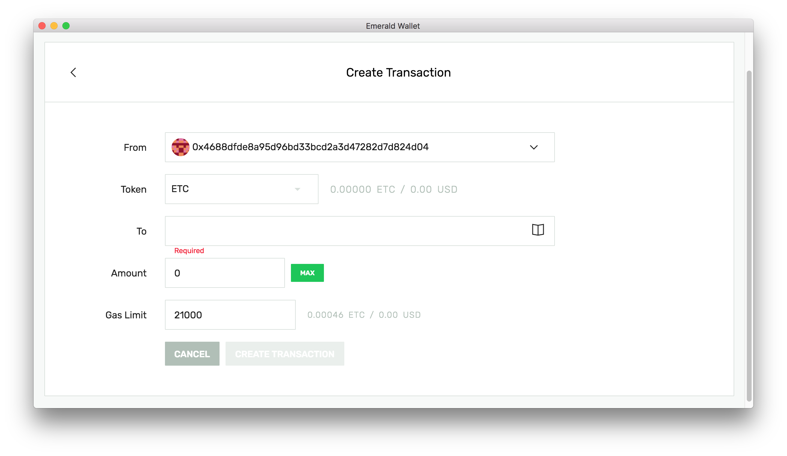

# Emerald Wallet

**GitHub** [https://github.com/ETCDEVTeam/emerald-wallet/releases](https://github.com/ETCDEVTeam/emerald-wallet/releases)

## Install

Download and install the latest release of the Emerald Wallet for your operating system from [https://github.com/ETCDEVTeam/emerald-wallet/releases](https://github.com/ETCDEVTeam/emerald-wallet/releases)


## Usage

### Welcome

Upon first opening the Emerald Wallet application, users have an option to _generate a new ETC account_ **or** _add an existing ETC account_ using **keystore file**, **private key**, and **ledger nano s**.


When generating or adding an ETC account, Emerald Wallet will require a password. This password will be used to sign transactions on behalf of that _particular_ account. 




Always backup **keystore files** and **private keys** for ETC accounts. ****Store them in a safe place.


### Overview


1. **Accounts' Value**
2. Current **block height** of network
3. **Node selection** \(full node, light node, test net node\)
4. **Settings** \(currency, language, hidden accounts, confirmations\)
5. **Account info**
6. **Account export** \(paper wallet, private key\)
7. **Accounts and Tokens** \(additional account and token options as well as _address book_\)
8. **Deposit and Send** buttons \(ETC or Tokens\)
9. **Transaction history**

### Node Selection

Emerald Wallet will download and sync a **Full Node** by default. This could take longer than desired for some users. To use a **Light Node**, use the node selector.


### Settings 

The settings menu allows a user to change the equivalent fiat currency in the App Bar, change language, show hidden accounts, and set transaction confirmation preference.



### Account Export

The account export button, `• • •`, allows a user to export a backup of their wallet. Users may choose to **Hide** the account. Any hidden accounts can be set to show by visiting **Settings**.


### Accounts and Tokens

The `+ Accounts and Tokens` menu allows a user a variety of account import options as well as adding a token by address. Many users may appreciate the **Address Book** feature 😊. 


### Deposit and Send

Following an account's info is the **deposit** and **send** buttons enabling a user to receive and send value.




### Transaction History

Transactions associated with the wallet's accounts are shown in the transaction history as well as confirmation status.


If running a **Full Node,** history may not show until node is synced to current block height


## Advanced Usage

### Development Instructions {#user-content-development-instructions}

The recommended way to assert that you are using the correct version of node is to use [nodenv](https://github.com/nodenv/nodenv), which will shim the `node` and `npm` commands and assert that the `local` version is set to what is specified in [.node-version](https://github.com/ETCDEVTeam/emerald-wallet/blob/master/.node-version).

Once nodenv is installed:

```text
$ nodenv install
```

The supported version of `node` is `v6`. If you run into build errors, please make sure that you are using NodeV6 by running `node --version`.

### Dependencies

**NPM packages**

This will install dependencies saved in `package.json` and `flow-typed` repository.

```text
$ npm run setup
```

### **Emerald and Geth**

**Emerald**

If you haven’t got `emerald` already installed on your system, you can execute `./dependencies.sh` to automatically `rustup` and use `cargo` to install `emerald-cli` and move it to the project’s base dir. Note: this command is idempotent _for rust and cargo_ \(it won’t try to install cargo if you’ve already got it\), but it will use cargo’s `-f` flag to force install `emerald-cli` and copy that version to the project directory.

**Geth**

If geth isn’t available in your project directory, upon launching the app, it automatically be downloaded and placed in your project base dir.

### Run for development

Firstly: a couple things aren’t working right. If you can fix either of these issues, @whilei will buy you a beer.

* _Issue 1_: `webpack-dev-server` isn’t working right with the current babel-webpack-electron-izing setup. So you’ve got to do your development in Electron for now. Which means you can’t run `npm run start:web`. Bummer.

With these caveats in mind, _you can run_:

_Terminal 1_

```text
# This will begin a live-watching compiler for ./src/ and ./electron/ folders
$ npm run build:all
```

_Terminal 2_

```text
# This will begin the simulated electron app pulling from those compiled sources.
$ npm run start:electron
```

#### Logs {#user-content-logs}

**Emerald logs**

Electron and Emerald logs persisted in:

* OSX: `~/Library/Logs/EmeraldWallet/log.log`
* Linux: `~/.config/EmeraldWallet/log.log`

**Geth logs**

During development, you’ll find geth’s logs in `./logs` right in the project base directory.

In production, logs will be nestled in

* OSX: `~/Library/Application Support/EmeraldWallet/`
* Windows: `%USERPROFILE%\AppData\Roaming\EmeraldWallet\logs`

#### Building alternatively {#user-content-building-alternatively}

You can also use a variety of alternate build options, eg.

```text
$ npm run build:all:nowatch
$ npm run build:web
```

#### Building distributions in development {#user-content-building-distributions-in-development}

You can run a distribution build in your development environment. Assuming you’ve already compiled `./src/` and `./electron/`, you’ll be able to run:

```text
$ npm run dist
```

This command will build for _your current system_. Note that there are configurations for several systems \(OSX, Linux, Windows\) specified in the `"build"` field of `package.json`, but the `dist` command will by default only build for the system it’s on.

Note: If you’re developing on OSX and have a developer signing identity on your machine, you can optionally disable that with `CSC_IDENTITY_AUTO_DISCOVERY=false`.

OSX is also able to build for Linux. Add `-ml` to that raw command to build for both OSX and Linux at the same time.

#### Troubleshooting {#user-content-troubleshooting}

Some preliminary things to try in case you run into issues:

* Clear out any persisted settings or userdata from previous trials
  * OSX: `~/Library/Application Support/EmeraldWallet`
  * Linux: `~/.config/EmeraldWallet`
  * Windows: `%APPDATA%\EmeraldWallet`

### Run tests

```text
npm run test:watch
```

or for single run:

```text
npm test
```

### Developer Chat {#user-content-contact}

Chat with us via [Gitter](https://gitter.im/ethereumproject/emerald-wallet)

