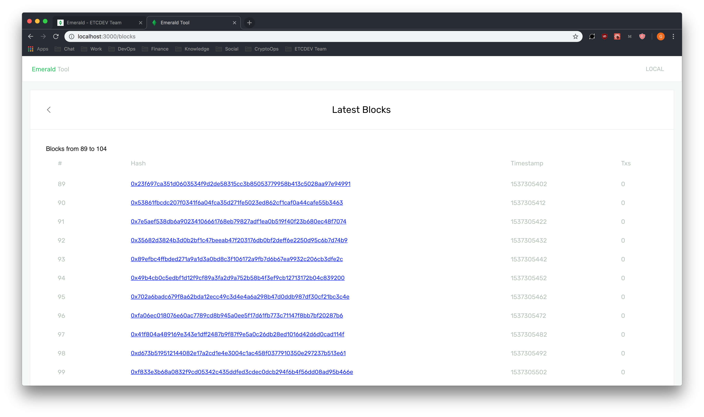
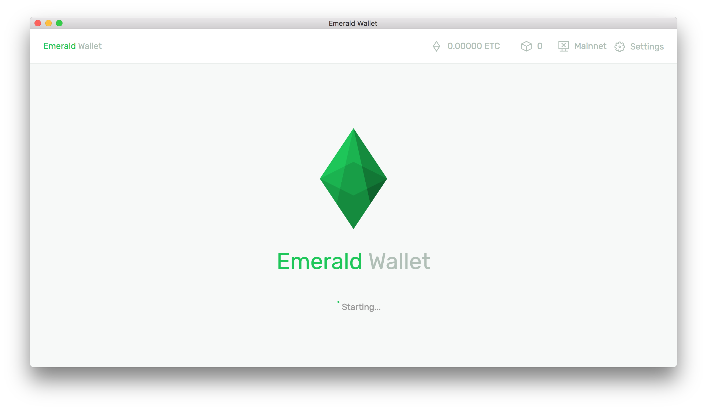

# Emerald CLI

**GitHub** [https://github.com/ETCDEVTeam/emerald](https://github.com/ETCDEVTeam/emerald)

## Dependencies

* ​[homebrew](https://brew.sh/) \(for macOS users\)
* ​[nodenv](https://github.com/nodenv/nodenv)
* [node-build](https://github.com/nodenv/node-build#readme)


If you have node already installed, then we recommend uninstalling node and npm before installing nodenv.  


Install nodenv and node-build using homebrew. 

```text
$ brew install nodenv
$ brew install node-build
```

Confirm nodenv and node-build are installed

```text
$ nodenv -v
nodenv 1.1.2
$ node-build --version
node-build 3.0.18
```

Install _stable_ node version using `nodenv install <version>` and make global using `nodenv global 8.11.1`

```text
$ nodenv install 8.11.1
$ nodenv global 8.11.1
```

Then initialize nodenv.

```text
$ nodenv init
```

You may be prompted to add or append `.bash_profile`

```text
$ nodenv init
# Load nodenv automatically by appending
# the follow to ~/.bash_profile:

eval "$(nodenv init -)"
```

Simply add  `eval "$(nodenv init -)"` to .`bash_profile` or create a `.bash_profile` if one does not exist already. Finally, run `nodenv init` when `.bash_profile` has been appended.

Confirm node directory. `Node` and `NPM` should be ready to use now.

```text
$ which node
/Users/JohnSmith/.nodenv/shims/node
```

## Install

#### Option 1 \(recommended\)

```text
$ brew install libgcrypt
$ npm install -g https://github.com/ETCDEVTeam/emerald.git
```

This process may take a few minutes. When it's done, Emerald will be installed globally. Open a new terminal window and run `emerald -h` to view commands and options.

```text
$ emerald -h

   emerald 0.0.2 

   USAGE

     emerald <command> [options]

   COMMANDS

     new                 Create a new project               
     testrpc             Run testnet for ethereum classic   
     wallet              Boot Emerald Wallet                
     explorer            Boot Explorer                      
     deploy              Deploy solidity to network         
     help <command>      Display help for a specific command

   GLOBAL OPTIONS

     -h, --help         Display help                                      
     -V, --version      Display version                                   
     --no-color         Disable colors                                    
     --quiet            Quiet mode - only displays warn and error messages
     -v, --verbose      Verbose mode - will also output debug messages
```


If emerald commands return nothing, then **nodenv** may simply need to rehash. 

`$ nodenv rehash`


#### Option 2

Download Emerald from the project repo [https://github.com/ETCDEVTeam/emerald](https://github.com/ETCDEVTeam/emerald) or `git clone`

```text
$ git clone https://github.com/ETCDEVTeam/emerald
```

Within the working directory run 

```text
$ npm link
```

## Usage

### emerald new

To create a new emerald project, run `emerald new` in terminal.

```text
$ mkdir my-dapp
$ cd my-dapp 
$ emerald new
New Emerald project created
```

By creating a new emerald project with the command `emerald new`, emerald will populate the working directory, `my-dapp` with an Emerald DApp environment.

```text
.
├── config
│   └── jest
│       ├── file-transform.ts
│       └── polyfills.ts
├── contracts
│   ├── Migrations.sol
│   └── Todos.sol
├── migrations
│   ├── 1_initial_migration.js
│   └── 2_deploy_contracts.js
├── package-lock.json
├── package.json
├── public
│   ├── favicon.ico
│   └── index.html
├── src
│   ├── App.test.tsx
│   ├── App.tsx
│   ├── contract-interfaces
│   │   └── ITodos.tsx
│   └── index.tsx
├── test
│   └── Todos.js
├── truffle-config.js
├── truffle.js
├── tsconfig.json
├── tslint.json
└── webpack.config.ts
```

### emerald testrpc

To run an Ethereum Classic testNet \(Sputnik VM Dev\), run `emerald testrpc`

```text
$ emerald testrpc
address: 74cbe1c04a9221f2a25050ba2fc6ef5cef77fee4
private key: 0x130bc24e27cd27f6bfaa3478db269f3fa703965e6c7a24d8ab3fc3b572ef2b18
```

Emerald testRPC will return 10 testNet addresses with their associated private keys.


Terminating the terminal running the testRPC will terminate the local testNet. Simply leave it to run in the background until you no longer need it running.


### emerald explorer

To view a blockchain explorer, run emerald explorer

```text
$ emerald explorer
```

The local block explorer will publish to [http://localhost:3000/blocks](http://localhost:3000/blocks). If a emerald testrpc is running, the explorer can toggle between the local testnet or mainnet in the app bar.



### emerald wallet

To open the Emerald Wallet, run `emerald wallet`

```text
$ emerald wallet
```

This will open the Emerald Wallet. If emerald testRPC is running, Emerald will will display the block height of the local testNet in the app bar.



### emerald deploy

To deploy an Emerald DApp to an Ethereum Classic network, run `emerald deploy` in the working directory of an Emerald DApp. The network specifications can be customized in `truffle.js` if needed. By default Emerald Wallet will connect with the emerald testRPC.

```text
$ emerald compile
$ emerald deploy
migrated
```


Deployment will fail if no network is running or configured properly in `truffle.js`


### emerald help

To view commands and options, run `emerald -h`

## License

License Apache 2.0

